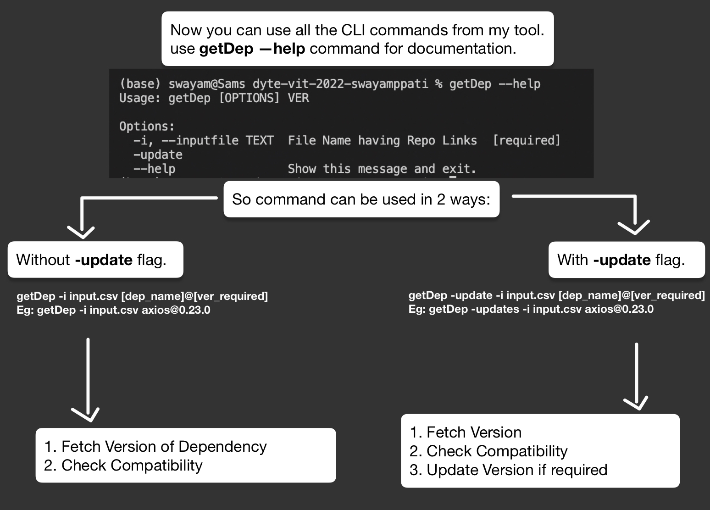
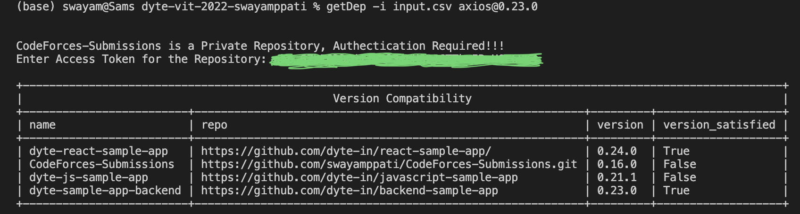
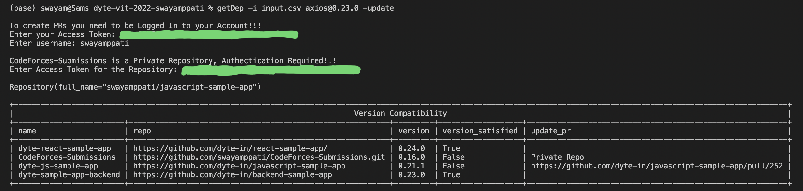
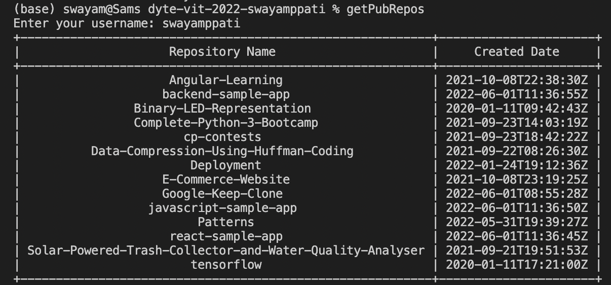
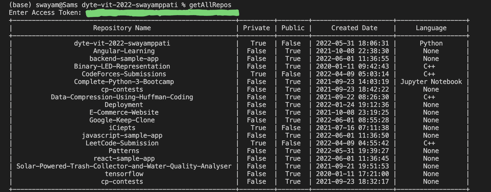

[](https://classroom.github.com/online_ide?assignment_repo_id=7951115&assignment_repo_type=AssignmentRepo)
<div id="top"></div>
<!--
*** Thanks for checking out the Best-README-Template. If you have a suggestion
*** that would make this better, please fork the repo and create a pull request
*** or simply open an issue with the tag "enhancement".
*** Don't forget to give the project a star!
*** Thanks again! Now go create something AMAZING! :D
-->


<!-- PROJECT SHIELDS -->
<!--
*** I'm using markdown "reference style" links for readability.
*** Reference links are enclosed in brackets [ ] instead of parentheses ( ).
*** See the bottom of this document for the declaration of the reference variables
*** for contributors-url, forks-url, etc. This is an optional, concise syntax you may use.
*** https://www.markdownguide.org/basic-syntax/#reference-style-links
-->
[![Contributors][contributors-shield]][contributors-url]
[![Forks][forks-shield]][forks-url]
[![Stargazers][stars-shield]][stars-url]
[![Issues][issues-shield]][issues-url]
[![MIT License][license-shield]][license-url]
[![LinkedIn][linkedin-shield]][linkedin-url]


<!-- PROJECT LOGO -->
<br />
<div align="center">
  <a href="https://github.com/dyte-submissions/dyte-vit-2022-swayamppati">
    
  </a>

<h3 align="center">Dependency Version Controller using CLI</h3>

  <p align="center">
    Fetch, View and Update Version of Dependencies from the CLI
    <br />
    <a href="https://github.com/dyte-submissions/dyte-vit-2022-swayamppati"><strong>Explore the docs »</strong></a>
    <br />
    <br />
    <a href="https://github.com/dyte-submissions/dyte-vit-2022-swayamppati">View Demo</a>
    ·
    <a href="https://github.com/dyte-submissions/dyte-vit-2022-swayamppati/issues">Report Bug</a>
    ·
    <a href="https://github.com/dyte-submissions/dyte-vit-2022-swayamppati/issues">Request Feature</a>
  </p>
</div>


<!-- TABLE OF CONTENTS -->
<details>
  <summary>Table of Contents</summary>
  <ol>
    <li>
      <a href="#about-the-project">About The Project</a>
      <ul>
        <li><a href="#built-with">Built With</a></li>
      </ul>
    </li>
    <li>
      <a href="#getting-started">Getting Started</a>
      <ul>
        <li><a href="#prerequisites">Prerequisites</a></li>
        <li><a href="#installation">Installation</a></li>
      </ul>
    </li>
    <li><a href="#usage">Usage</a></li>
    <li><a href="#roadmap">Roadmap</a></li>
    <li><a href="#contributing">Contributing</a></li>
    <li><a href="#license">License</a></li>
    <li><a href="#contact">Contact</a></li>
    <li><a href="#acknowledgments">Acknowledgments</a></li>
  </ol>
</details>


<!-- ABOUT THE PROJECT -->
## About The Project

This project is build to handle the version of different dependencies belonging to various repositories from CLI.


### Built With

* [Python](https://www.python.org/)

<p align="right">(<a href="#top">back to top</a>)</p>


<!-- GETTING STARTED -->
## Getting Started

### Prerequisites

List of things you need to install to use the CLI tool.
* PyGithub : The PyGithub library is an open-source Python library that can use the GitHub API V3 in Python.
  ```sh
  sudo pip install PyGithub
  ```
* PrettyTable : PrettryTable library is used to print the data in a tabular format.
  ```sh
  sudo pip install prettytable
  ```
* Access-Tokens
  ```sh
  If you want to generate a PR then you must login to a Github account using a Access Token.
  If you want to access a private repo, then you must have their Access Token.
  To get an access-token: follow the documentation below:
  ```
* [Access-Token Docs](https://docs.github.com/en/authentication/keeping-your-account-and-data-secure/creating-a-personal-access-token)

### Installation

1. Clone the repo
   ```sh
   git clone https://github.com/dyte-submissions/dyte-vit-2022-swayamppati.git
   ```
2. Go to the path inside the repo using terminal and Install the CLI tool.
   ```sh
   sudo pip install --editable .
   ```

<p align="right">(<a href="#top">back to top</a>)</p>


<!-- USAGE EXAMPLES -->
## Usage

1. Now place all the repository links that you want to use the CLI tool on, inside the input.CSV file in the downloaded repo.
2. Leave the first line of name, repo as it is.
3. From the second line onwards the format must be as: name, repolink(HTTPS)
4. You can also place private repos, but only version check can be done.



### Without -update flag
#### Additionally you need to enter the access-tokens if you want to access any private repos.


### With -update flag
#### Additionally you need to enter the access-tokens so that repos can be forked and PRs can be created.


<p align="right">(<a href="#top">back to top</a>)</p>


<!-- ROADMAP -->
## Roadmap

- [ ] Fetch, View and Update Version of Dependencies from the CLI
   ```sh
   getDep -i input.csv axios@0.23.0
   ```
   or
   ```sh
   getDep -update -i input.csv axios@0.23.0
   ```

### Additional Features
- [ ] Fetch Public Repos for a username along with Created Date.
   ```sh
   getPubRepos
   ```
   

- [ ] Fetch Both Private and Public Repos with various details using access-token.
  ```sh
   getPubRepos
   ```
   

- [ ] Basic Greeting
  ```sh
   getStart
   ```
   
See the [open issues](https://github.com/dyte-submissions/dyte-vit-2022-swayamppati/issues) for a full list of proposed features (and known issues).

<p align="right">(<a href="#top">back to top</a>)</p>


<!-- CONTRIBUTING -->
## Contributing

Contributions are what make the open source community such an amazing place to learn, inspire, and create. Any contributions you make are **greatly appreciated**.

If you have a suggestion that would make this better, please fork the repo and create a pull request. You can also simply open an issue with the tag "enhancement".
Don't forget to give the project a star! Thanks again!

1. Fork the Project
2. Create your Feature Branch (`git checkout -b feature/AmazingFeature`)
3. Commit your Changes (`git commit -m 'Add some AmazingFeature'`)
4. Push to the Branch (`git push origin feature/AmazingFeature`)
5. Open a Pull Request

<p align="right">(<a href="#top">back to top</a>)</p>


<!-- CONTACT -->
## Contact

Swayam Prakash Pati - swayamppati@gmail.com

Project Link: [https://github.com/dyte-submissions/dyte-vit-2022-swayamppati](https://github.com/dyte-submissions/dyte-vit-2022-swayamppati)

<p align="right">(<a href="#top">back to top</a>)</p>


<!-- MARKDOWN LINKS & IMAGES -->
<!-- https://www.markdownguide.org/basic-syntax/#reference-style-links -->
[contributors-shield]: https://img.shields.io/github/contributors/dyte-submissions/dyte-vit-2022-swayamppati.svg?style=for-the-badge
[contributors-url]: https://github.com/dyte-submissions/dyte-vit-2022-swayamppati/graphs/contributors
[forks-shield]: https://img.shields.io/github/forks/dyte-submissions/dyte-vit-2022-swayamppati.svg?style=for-the-badge
[forks-url]: https://github.com/dyte-submissions/dyte-vit-2022-swayamppati/network/members
[stars-shield]: https://img.shields.io/github/stars/dyte-submissions/dyte-vit-2022-swayamppati.svg?style=for-the-badge
[stars-url]: https://github.com/dyte-submissions/dyte-vit-2022-swayamppati/stargazers
[issues-shield]: https://img.shields.io/github/issues/dyte-submissions/dyte-vit-2022-swayamppati.svg?style=for-the-badge
[issues-url]: https://github.com/dyte-submissions/dyte-vit-2022-swayamppati/issues
[license-shield]: https://img.shields.io/github/license/dyte-submissions/dyte-vit-2022-swayamppati.svg?style=for-the-badge
[license-url]: https://github.com/dyte-submissions/dyte-vit-2022-swayamppati/blob/master/LICENSE.txt
[linkedin-shield]: https://img.shields.io/badge/-LinkedIn-black.svg?style=for-the-badge&logo=linkedin&colorB=555
[linkedin-url]: https://linkedin.com/in/swayampati
[product-screenshot]: images/screenshot.png
